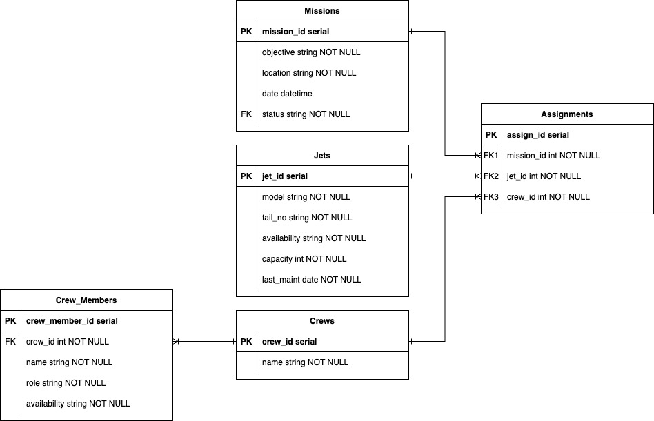

# App README

## Public Deployments
### Database
**Neon:**
- Database name: missiondash_db
- User: mission_dev

### Web Service
**Render:** https://missiondash.onrender.com

## Purpose

This application manages missions, jets, crews, crew members, and their assignments in a flight operation context. It allows users to create, update, retrieve, and delete data related to these entities while ensuring all validation rules are enforced. This app is built using Python, Flask, and SQLAlchemy with Marshmallow for schema validation.

## Database
PostgreSQL will be used as the database in this project as its relational nature suits the structured data model and complex relationships between entities.

It is more appropriate than MongoDB for transactional data requiring strict consistency (e.g., mission assignments).


## Entities and Relationships

### Entity Relationship Diagram


### Entities

1. **Mission**
   - Attributes: `mission_id`, `objective`, `location`, `datetime`, `status`
   - Relationships: One-to-many with Assignments

2. **Jet**
   - Attributes: `jet_id`, `model`, `tail_no`, `availability`, `capacity`, `last_maint`
   - Relationships: One-to-many with Assignments

3. **Crew**
   - Attributes: `crew_id`, `name`
   - Relationships: One-to-many with Crew Members, one-to-many with Assignments

4. **Crew Member**
   - Attributes: `crew_member_id`, `crew_id`, `name`, `role`, `availability`
   - Relationships: Many-to-one with Crew

5. **Assignment**
   - Attributes: `assign_id`, `mission_id`, `jet_id`, `crew_id`
   - Relationships: Many-to-one with Mission, Jet, and Crew

### Relationships

- **Mission** is linked to **Assignment** (one-to-many).
- **Jet** is linked to **Assignment** (one-to-many).
- **Crew** is linked to **Assignment** (one-to-many) and **Crew Member** (one-to-many).
- **Assignment** combines Mission, Jet, and Crew in a one-to-many relationship.

## Installation Instructions

### Prerequisites

- A computer with internet access
- **Operating System**: Windows, macOS, or Linux
- **Python**: Version 3.10+

### Step-by-Step Guide

#### 1. Install Python

Download Python from the [official website](https://www.python.org/) and install it. Ensure you add Python to your PATH during the installation.

#### 2. Install VS Code

Download and install [Visual Studio Code](https://code.visualstudio.com/). Install the "Python" extension for VS Code.

#### 3. Clone the Repository

Open the terminal and run the following command to clone the repository:
```bash
git clone <repository-url>
```
Navigate to the project folder:
```bash
cd <repository-folder>
```

#### 4. Set Up a Virtual Environment

Create a virtual environment:
```bash
python -m venv .venv
```
Activate the virtual environment:
- **Windows**: `.venv\Scripts\activate`
- **macOS/Linux**: `source .venv/bin/activate`

#### 5. Install Dependencies

Install required packages from `requirements.txt`:
```bash
pip install -r requirements.txt
```

#### 6. Set Up Environment Variables

Create a `.env` file in the project root with the following content:
```
DATABASE_URI=<your-database-uri>
```

#### 7. Initialise the Database

Run the following commands to create and seed the database:
```bash
flask db create
flask db seed
```

#### 8. Start the Application

Run the Flask app:
```bash
flask run
```
The app will be available at [http://127.0.0.1:8080](http://127.0.0.1:8080).

## Functionality and Entity Descriptions
Each entity features all **CRUD** operations.

### Mission

- **Purpose**: Manage details of a mission.
- **Validation**:
  - `objective`: Minimum 3 characters, only alphanumeric and spaces.
  - `location`: Same as `objective`.
  - `datetime`: Must follow format `YYYY-MM-DD HH:MM:SS`.
  - `status`: One of `Planning`, `Scheduled`, `In Progress`, `Completed - Success`.
- **Sample Code**:
```python
new_mission = Mission(objective="Reconnaissance", location="Alpha Sector", datetime="2024-12-15 10:00:00", status="Scheduled")
db.session.add(new_mission)
db.session.commit()
```

### Jet

- **Purpose**: Manage details of jets.
- **Validation**:
  - `model`: Alphanumeric with special characters, no spaces.
  - `tail_no`: Must be in the format `NNNXXX`.
  - `availability`: One of `Serviceable`, `Unserviceable`, `On Mission`.
  - `capacity`: Integer.
- **Sample Code**:
```python
new_jet = Jet(model="F16A", tail_no="123ABC", availability="Serviceable", capacity=1, last_maint="2024-11-20")
db.session.add(new_jet)
db.session.commit()
```

### Crew

- **Purpose**: Manage crew groups.
- **Validation**:
  - `name`: Max 10 characters, starts with an uppercase letter, only letters.
- **Sample Code**:
```python
new_crew = Crew(name="Alpha")
db.session.add(new_crew)
db.session.commit()
```

### Crew Member

- **Purpose**: Manage individual crew members.
- **Validation**:
  - `name`: Must follow the format `Firstname Lastname`.
  - `role`: One of `Pilot`, `Co-Pilot`, `Loadmaster`.
  - `availability`: One of `Available`, `On Mission`, `On Leave`, `Unavailable`, `In Training`, `Retired`.
- **Sample Code**:
```python
new_member = CrewMember(crew_id=1, name="John Doe", role="Pilot", availability="Available")
db.session.add(new_member)
db.session.commit()
```

### Assignment

- **Purpose**: Link missions, jets, and crews.
- **Validation**:
  - `mission_id`, `jet_id`, `crew_id`: Must exist.
  - The combinaton of all three ID's must be unique. For example, `mission_id=1`, `jet_id=1`, `crew_id=1` can only be added once. Trying to add the same combination again will result in an error.
  - Jet capacity matches crew size.
  - One pilot per crew.
  - Jet is `Serviceable`.
  - Mission is in `Planning` status.
- **Sample Code**:
```python
new_assignment = Assignment(mission_id=1, jet_id=2, crew_id=3)
db.session.add(new_assignment)
db.session.commit()
```

## Feedback
The following feedback was gathered and implemented during the planning and development phase.

### Planning Feedback

- **Strengths**:
  - The purpose is clear and well-articulated, making it easy to understand the project's goals.
  - Comprehensive scope and database design.
  - The Entity-Relationship Diagram (ERD) is well-structured and easy to follow.

- **Areas for Improvement**:
  - Consider allowing more than one jet and crew to be assigned to a mission for enhanced flexibility.

### Jet Model, Schema, and Controller Feedback

- **Strengths**:
  - Excellent use of error handling with Marshmallow validation and SQLAlchemy IntegrityError.
  - Clear and informative response messages for API users.
  - The `string_validator` function promotes code reusability and adheres to DRY principles.

- **Areas for Improvement**:
  - Add explicit field lengths to all string fields for additional database-level validation.
  - Implement consistent use of `["GET"]` method in route decorators to enhance readability.

### Updates Implemented Based on Feedback

- Added explicit length constraints to all string fields in models.
- Ensured all `GET` routes include the `["GET"]` method for clarity.
- Fixed duplicate code in the `update_jet` function.

## Additional Notes

- For any issues, refer to the Flask app logs or database logs.
- Make sure your `.env` file is correctly configured for database connectivity.

---

End of README


